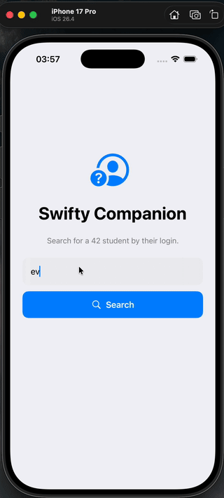

# Swifty Companion

Une petite app iOS qui affiche le profil d'un étudiant 42 à partir de son login,
en utilisant l'API de l'intra. On tape un login, et on tombe sur sa photo, ses
infos, son niveau, ses skills et la liste de ses projets.

Projet réalisé à 42 (Mobile Initiation).

## Démo

<p align="center">
  
</p>

## Stack

- **Swift / SwiftUI**, interface 100% native
- **URLSession**, appels réseau sans librairie tierce
- **OAuth2** (client credentials), authentification à l'API 42
- **Keychain**, le token y est stocké et réutilisé tant qu'il est valide

## Lancer le projet

Il faut une application enregistrée sur l'intra
(`profile.intra.42.fr/oauth/applications`) pour récupérer un `UID` et un `SECRET`.

1. Copier le modèle de config et le remplir avec ses identifiants :

   ```bash
   cp .env.example swifty-compagnion/.env
   ```

2. Ouvrir `swifty-compagnion.xcodeproj` dans Xcode, puis `⌘R`.

Le `.env` n'est pas versionné (cf. `.gitignore`) : chacun met ses propres clés.

## Comment c'est organisé

```
swifty-compagnion/
├── Models/        structures qui collent au JSON de l'API
├── Services/      réseau, OAuth2, lecture du .env, Keychain
├── ViewModels/    état de la recherche
└── Views/         l'écran de recherche et l'écran de profil
```

Deux écrans : la recherche, puis le profil (avec un retour en arrière). Les
erreurs sont gérées au cas par cas : login inexistant, coupure réseau, token
expiré (qui se régénère tout seul).
